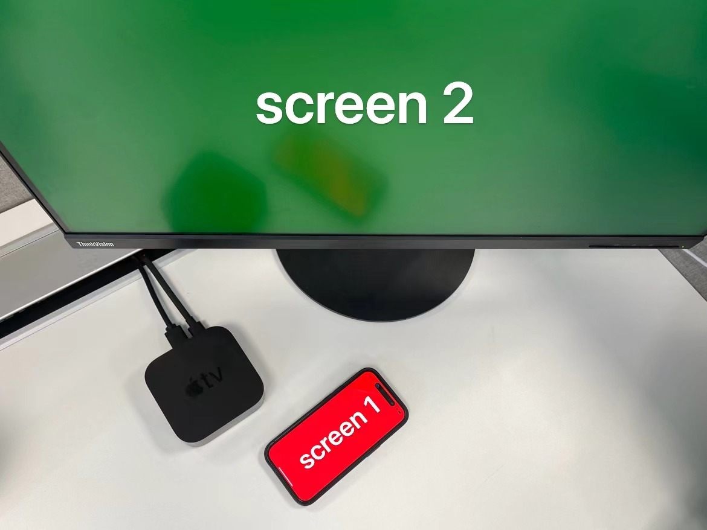

# Screen Demo

There are two demos in the project, each using either `AppDelegate` or `SceneDelegate` (recommended) to manage the app's windows. The goal is to use UIKit to display custom content on a TV through AirPlay.

